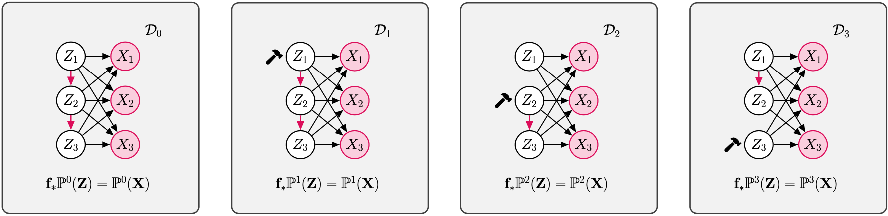

# Causal Component Analysis (CauCA)
[](https://pytorch.org/)
[](https://lightning.ai/)
[](https://github.com/psf/black)
[](https://opensource.org/licenses/MIT)
[](https://arxiv.org/abs/2305.17225)



## Overview
_Causal Component Analysis_ is a project that bridges the gap between Independent Component Analysis (ICA) and Causal Representation Learning (CRL).
This project includes implementations and experiments related to the papers:
1.  > Liang, W., Kekić, A., von Kügelgen, J., Buchholz, S., Besserve, M., Gresele, L., & Schölkopf, B. (2023).
    [Causal Component Analysis](https://openreview.net/forum?id=HszLRiHyfO).
    In Proceedings of the Thirty-seventh Conference on Neural Information Processing Systems.
    
    The corrsponding experiments are in the [experiments/cauca](experiments/cauca/README.md) folder.

2.  > von Kügelgen, J., Besserve, M., Liang, W., Gresele, L., Kekić, A., Bareinboim, E., Blei, D., & Schölkopf, B. (2023).
    [Nonparametric Identifiability of Causal Representations from Unknown Interventions](https://openreview.net/forum?id=V87gZeSOL4).
    In Proceedings of the Thirty-seventh Conference on Neural Information Processing Systems.
    
    The corrsponding experiments are in the [experiments/nonparam_ident](experiments/nonparam_ident/README.md) folder.
## Installation
Clone the repository
```bash
git clone git@github.com:akekic/causal-component-analysis.git
```
and install the package
```bash
pip install -e .
```


## License
This project is licensed under the [MIT license](https://opensource.org/licenses/MIT). See the [LICENSE](LICENSE) file for details.

## Citation

If you use `CauCA`, please cite the 
[corresponding paper](https://openreview.net/forum?id=HszLRiHyfO) as follows.

> Liang, W., Kekić, A., von Kügelgen, J., Buchholz, S., Besserve, M., Gresele, L., & Schölkopf, B. (2023).
> Causal Component Analysis. 
> In Proceedings of the Thirty-seventh Conference on Neural Information Processing Systems.

**Bibtex**

```
@inproceedings{
    liang2023causal,
    title={Causal Component Analysis},
    author={Wendong Liang and Armin Keki{\'c} and Julius von K{\"u}gelgen and Simon Buchholz and Michel Besserve and Luigi Gresele and Bernhard Sch{\"o}lkopf},
    booktitle={Thirty-seventh Conference on Neural Information Processing Systems},
    year={2023},
    url={https://openreview.net/forum?id=HszLRiHyfO}
}
```
